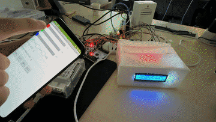
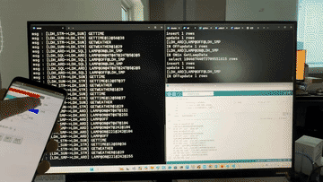
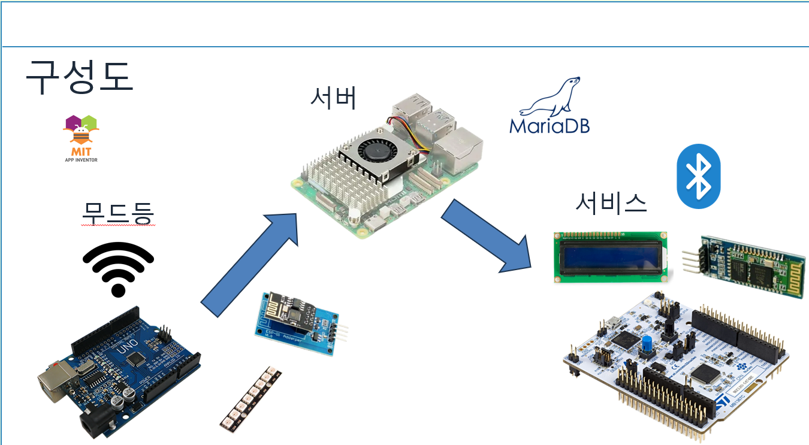
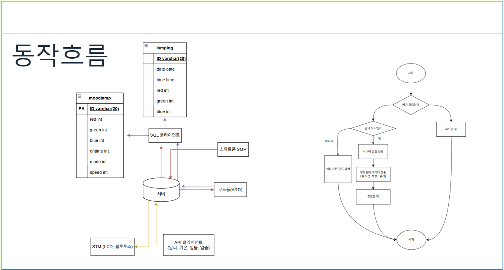

# 스마트 무드등 (스위치 & 스마트폰 제어)

스위치와 스마트폰 앱을 이용해 무드등을 제어하는 프로젝트입니다.  
소켓 통신을 사용해 스마트폰에서 무드등의 전원 및 동작 상태를 제어하고,  
현재 상태를 앱과 LED에 동시에 반영합니다.

---

## 1. 데모 영상 (GIF)

### 🔹 스위치로 제어

<p align="center">
  
</p>

---

### 🔹 스마트폰(앱)으로 제어

<p align="center">
  
</p>

---

### 🔹 데이터 흐름 / 통신 시퀀스

<p align="center">
  
</p>

---

## 2. 프로젝트 개요

- **핵심 목표**
  - 물리 스위치와 스마트폰 앱 두 가지 방법으로 **무드등을 제어**
  - 소켓 통신을 사용해 **양방향 상태 동기화** (앱 ↔ 무드등)
- **기능 예시**
  - 무드등 전원 ON / OFF
  - 동작 모드 변경 (예: 기본 모드, 무드 모드 등 프로젝트에 맞게 구성)
  - 스위치 조작 시 앱 화면 상태 업데이트
  - 앱 조작 시 실제 무드등 상태 변경

---

## 3. 시스템 구성도

프로젝트 전체 구성을 그림으로 정리한 이미지입니다.

<p align="center">
  
</p>

- 물리 스위치 → 무드등 제어 신호 입력  
- 스마트폰 앱 → 소켓 통신으로 제어 명령 전송  
- 제어 보드(마이크로컨트롤러 / 통신 모듈 등) → 스위치/앱 입력을 받아 LED 제어  
- LED / 무드등 모듈 → 실제 조명 출력  

---

## 4. 동작 순서도

프로그램/앱의 전체 동작 흐름을 순서도로 나타낸 이미지입니다.

<p align="center">
  
</p>

- 전원 ON 후 초기화
- 소켓 연결 및 스위치/앱 입력 대기
- 스위치 입력 또는 앱 명령 수신
- 현재 상태 갱신 후 LED 및 앱 화면에 반영

(세부 분기/상태는 순서도 이미지를 참고)

---

## 5. 모바일 앱 (MIT App Inventor)

이 프로젝트에 사용한 스마트폰 앱은 **MIT App Inventor**로 개발되었습니다.

- 프로젝트 소스 파일: `TestSocket.aia`

앱인벤터에서 불러오는 방법:

1. MIT App Inventor 웹사이트 접속 후 로그인  
2. 상단 메뉴에서 **`Projects` → `Import project (.aia) from my computer`** 선택  
3. 레포지토리에 포함된 `TestSocket.aia` 파일을 선택  
4. 프로젝트가 생성되면 블록/디자이너 화면에서 앱 동작을 확인하고 수정할 수 있습니다.

> 참고: `.aia`는 **앱 소스 전체가 들어있는 파일**이며,  
> 필요시 이 파일 하나로 언제든지 프로젝트를 복구할 수 있습니다.

---

## 6. 폴더 / 파일 구성 예시

```text
SmartMoodLamp
├── README.md
├── ControlBySwitch.gif      # 스위치 제어 데모
├── ControlByCellphon.gif    # 스마트폰 제어 데모
├── DataFlow.gif             # 데이터 흐름/통신 데모
├── 구성도.png               # 시스템 구성도
├── 순서도.png               # 동작 순서도
└── TestSocket.aia           # MIT App Inventor 앱 소스
